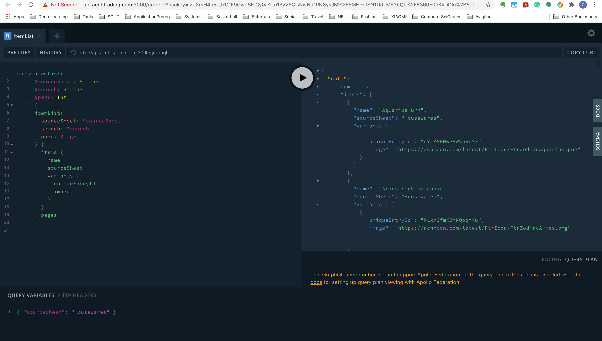
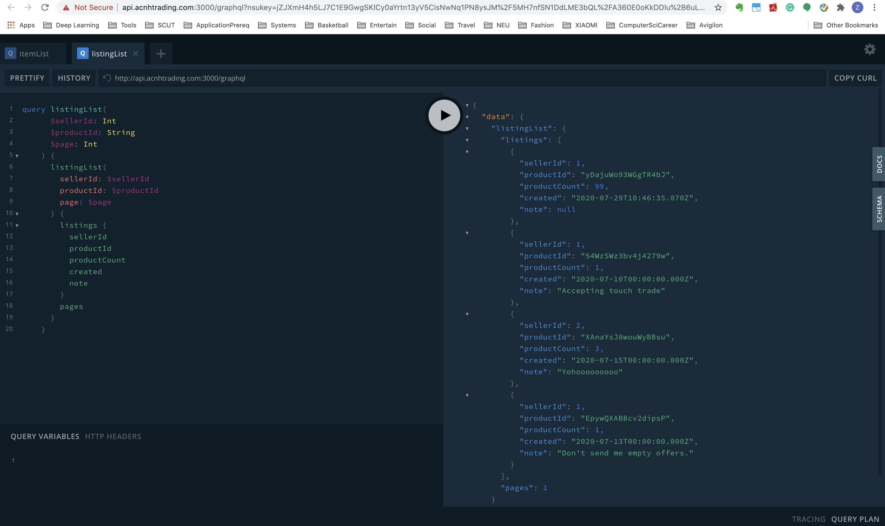

# GroupProject_ppttptsfzzsf_API

## Team
* Shengfu Zhang
* Ziqi Tang

## Useful Links
* Links to API Repo: https://github.ccs.neu.edu/NEU-CS5610-SU20/GroupProject_ppttptsfzzsf_API.git
* Links to UI Repo: https://github.ccs.neu.edu/NEU-CS5610-SU20/GroupProject_ppttptsfzzsf_UI.git
* Links to Heroku Page: https://acnh-trading-ui.herokuapp.com/

## Iterations 1 Progress
* We used book project as the boilerplate code and build our projects on top of that.
* We found the Animal Crossing New Horizon product spreadsheet dataset and use Json 
parse tool to load into the MongoDB Altas cluster.
* We created new schemas for different queries for our Animal Crossing products and the CRUD operations.
* We added new APIs for CRUD operations in our API server.
* For UI server, we added pages for our product category lists. The user profile page is still under construction.
* For product displaying pages, we add different components for different categories where the related API is called to 
load the data and render them using Grid and Panel.

## Data Source
Data Spreadsheet for Animal Crossing New Horizons: 
https://discord.gg/8jNFHxG

## Snapshots and Descriptions

* graphQl query for items

* graphQl query for listings

